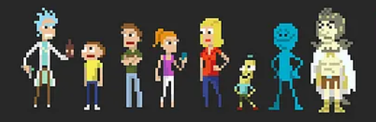
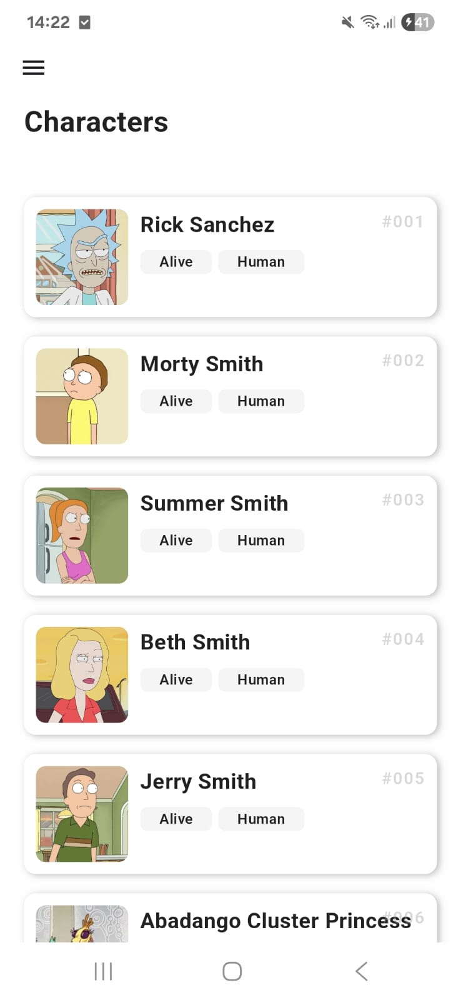
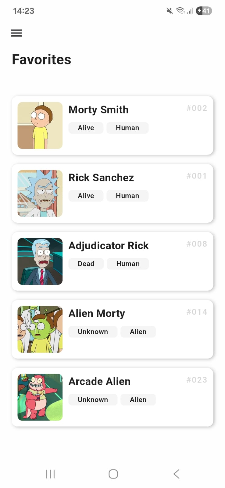
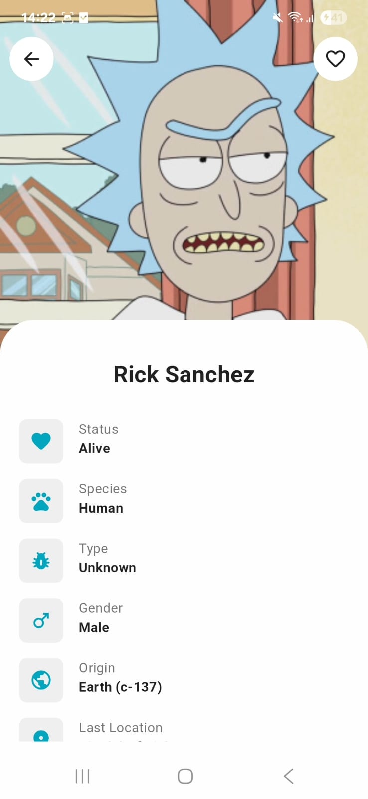
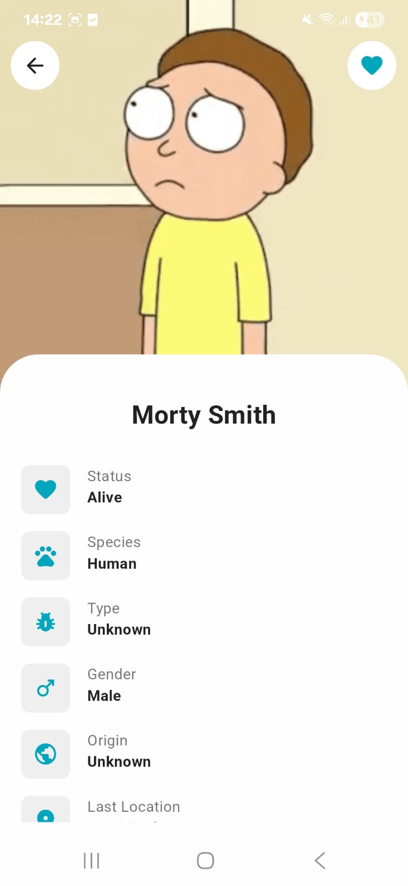
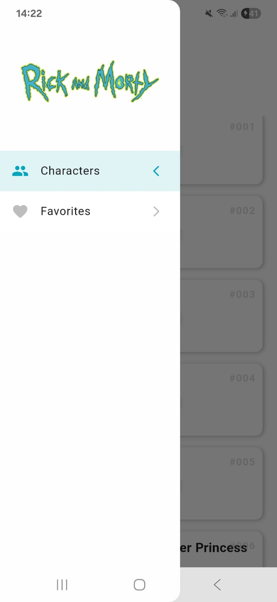
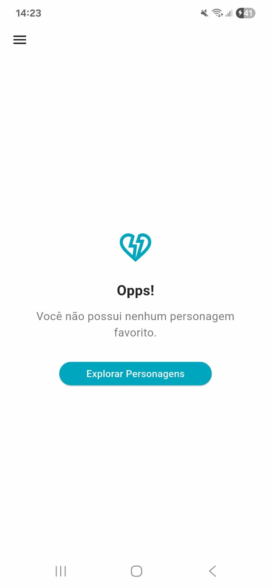
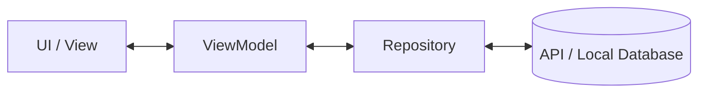

# RickDex - Rick and Morty App




Um aplicativo Flutter que consome a API pública do Rick and Morty para explorar personagens da série.
Construído com arquitetura MVVM, foco em boas práticas e organização de código.

## Screenshots

<p align="left">
  
  
  
</p>
<p align="left">
  
  
  
</p>

## Funcionalidades

- [x] Listagem de personagens com paginação infinita;
- [x] Pull-to-Refresh para atualização da lista de personagens;
- [x] Tratamento de erros de rede e locais;
- [x] Testes unitários e de integração;
- [x] Ver detalhes completos do personagem;
- [x] Favoritar e desfavoritar personagens;
- [x] Persistência local de favoritos;
- [x] Interface responsiva;

## Arquitetura

O projeto utiliza a arquitetura **MVVM (Model-View-ViewModel** e **Change Notifier** para gerenciamento de estado. Essa escolha garante:
- Separação clara de responsabilidades;
- Facilidade de manutenção e testes;
- Escabilidade para novas features;

### Visão geral:


### Estrutura de pastas:

```
lib/
├── main.dart
└── src            # código fonte do app
  ├── core/        # infraestrutura (rotas, injeção de dependências, excessões)
  ├── models/      # modelo de dados (entidades, dtos e repositórios)
  └── ui/          # telas, gerenciamento de estado, widgets e temas
```

## Tecnologias utilizadas:
- Flutter / Dart;
- Provider;
- GoRouter;
- Hive;
- Mocktail;

## Como executar

1. **Clone o repositório**
```bash
git clone https://github.com/devRenata/RickDex.git
cd RickDex
```

2. **Instale as dependências**
```bash
flutter pub get
```

3. **Execute o aplicativo**
```bash
flutter run
```
